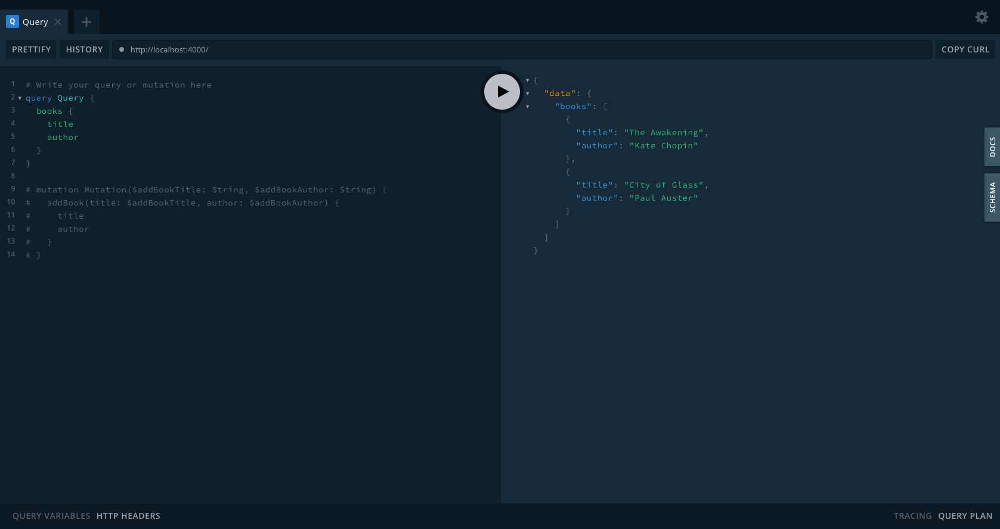

# Building a GraphQL API with Apollo Server

## Apollo Server
For help getting started with GraphQL Apollo Server, view online
[documentation](https://www.apollographql.com/).

#### 1. [Setup Node](https://nodejs.org/en/)

#### 2. Clone the repo

```sh
$ https://github.com/asifvora/graphql-server API.git
$ cd graphql-server/
```

#### 3. Install dependency

```sh
$ npm install
```

#### 4. Run the server

```sh
$ npm start
```
- Go to `http://localhost:PORT_NUMBER` to see the app running

